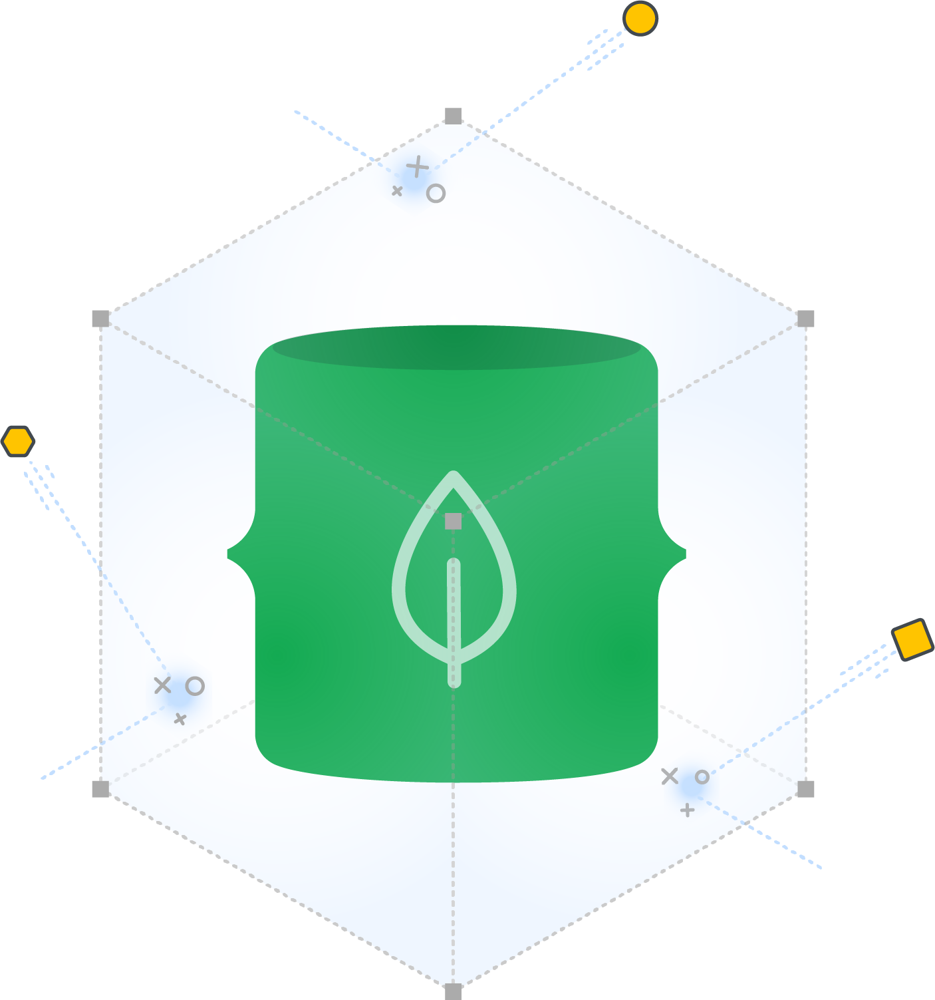
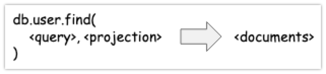
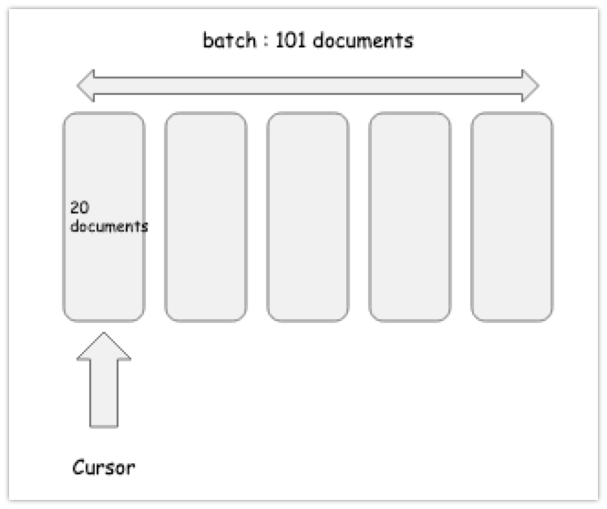

# 몽고DB - find,프로젝션,커서




# 참고자료

[맛있는 MongoDB, 비제이퍼블릭, 정승호 저](http://www.yes24.com/Product/Goods/85011885)


# find() 메서드 (조회연산)

몽고 DB의 find 메서드는 데이터를 조회할 때 사용하는 메서드이다. SQL의 SELECT와 같은 역할을 하는 메서드이다.  

아래 그림은 find 메서드의 형식과 반환값을 그려본 그림이다.




## 샘플 데이터 INSERT

```javascript
> db.suwon_cafe.insertMany([
... {name: 'Americano', price: 1000, minute: 3},
... {name: 'Milk tea', price: 2000, minute: 4},
... {name: 'CaffeLatte', price: 2000, minute: 4}
... ])
{
	"acknowledged" : true,
	"insertedIds" : [
		ObjectId("605eb7dc69ec4e48c406de0d"),
		ObjectId("605eb7dc69ec4e48c406de0e"),
		ObjectId("605eb7dc69ec4e48c406de0f")
	]
}

...
```


## find() - 모두 조회하기

```javascript
> db.suwon_cafe.find()
{ "_id" : ObjectId("605eb7dc69ec4e48c406de0d"), "name" : "Americano", "price" : 1000, "minute" : 3 }
{ "_id" : ObjectId("605eb7dc69ec4e48c406de0e"), "name" : "Milk tea", "price" : 2000, "minute" : 4 }
{ "_id" : ObjectId("605eb7dc69ec4e48c406de0f"), "name" : "CaffeLatte", "price" : 2000, "minute" : 4 }
```


## find({query}) - 검색조건을 지정하여 조회하기

```javascript
> db.suwon_cafe.find({price: 2000, minute: 4})
{ "_id" : ObjectId("605eb7dc69ec4e48c406de0e"), "name" : "Milk tea", "price" : 2000, "minute" : 4 }
{ "_id" : ObjectId("605eb7dc69ec4e48c406de0f"), "name" : "CaffeLatte", "price" : 2000, "minute" : 4 }
```


# 프로젝션

프로젝션은 각각의 도큐먼트의 어떤 필드를 포함해서 결과값으로 반환할지 결정할 때 사용하는 인자값이다. 프로젝션으로 도큐먼트의 모든 필드를 불러오는 것이 아니라 원하는 필드만 가져오면 불러올 정보의 양을 줄일수 있게 되어 애플리케이션의 속도를 향상시킬 수 있다.  


단순 사용을 위해서라면, 프로젝션에 대해서는 간단히 아래의 내용만 기억하고 있으면 되지 않을까 싶다.

- 불러올 필드에 대한 값으로 true, false 를 지정해서 어떤 필드를 불러올지 결정하는 것이 가능하다.
- `_id` 필드의 경우에도 불러올지 말지 결정할 수 있는데, false 를 지정하게 되면 `_id` 를 불러오지 않는다.
- find 명령시 `_id` 필드는 기본으로 불러오는 것이 기본 값이다. 하지만 `_id` 필드를 false로 설정하면 `_id`  필드를 불러오지 않는다.


**현재 저장된 데이터 확인**

```javascript
> db.suwon_cafe.find()
{ "_id" : ObjectId("605eb7dc69ec4e48c406de0d"), "name" : "Americano", "price" : 1000, "minute" : 3 }
{ "_id" : ObjectId("605eb7dc69ec4e48c406de0e"), "name" : "Milk tea", "price" : 2000, "minute" : 4 }
{ "_id" : ObjectId("605eb7dc69ec4e48c406de0f"), "name" : "CaffeLatte", "price" : 2000, "minute" : 4 }
```

  

**name 필드만 select 해서 불러오기**

```javascript
name 필드만 select 해서 불러오기
> db.suwon_cafe.find(null, {name: true})
{ "_id" : ObjectId("605eb7dc69ec4e48c406de0d"), "name" : "Americano" }
{ "_id" : ObjectId("605eb7dc69ec4e48c406de0e"), "name" : "Milk tea" }
{ "_id" : ObjectId("605eb7dc69ec4e48c406de0f"), "name" : "CaffeLatte" }
```

  

**`_id` 필드와 name 필드를 제외하고 출력해보기**

```javascript
> db.suwon_cafe.find(null, {name: false, _id: false})
{ "price" : 1000, "minute" : 3 }
{ "price" : 2000, "minute" : 4 }
{ "price" : 2000, "minute" : 4 }
```


# 커서

커서는 쿼리 결과에 대한 포인터를 의미한다. find 명령어는 도큐먼트를 직접 반환하지 않는다. 대신 커서를 반환한다. 더 나은 성능을 위해서이다.

- 예를 들어 find 문의 결과로 1000만개의 도큐먼트가 커서를 반환하지 않고 직접 반환한다면 많은 연산 시간을 소모하게 될 수 있다.
- 만약 샤딩이 되어 있다면 모든 샤드에서 도큐먼트를 불러들이기 대문에 시간이 훨씬 많이 필요하게 된다.
- 만약 포인터를 이용하게 된다면 해당 도큐먼트의 위치 정보만을 반환해주면, 작업을 효율적으로 수행할 수 있게 된다.
- 커서는 시간제한 10분을 넘기면 비활성 상태로 전환된다. 
- 커서는 아래에 첨부한 그림과 같은 동작을 한다.
- 좀더 쉽게 설명한다면, 책갈피로 어떤 위치를 기억해두는 것이라고 이해하면 편할 듯 싶다. 단, 책갈피를 꽂아놓은 후 10분 뒤에 이 책갈피를 버린다.




**샘플 컬렉션 생성**

```javascript
> db.createCollection("cappedCollection", { capped: true, size: 10000 })
{ "ok" : 1 }
>
> for(i=0; i<1000; i++){
... db.cappedCollection.insertOne({x: i})
... }
{
	"acknowledged" : true,
	"insertedId" : ObjectId("605efef169ec4e48c406e1f7")
}
>
```


**중간 데이터를 조회한 커서로 cursor.hasNext() 해보기**

```javascript
> db.cappedCollection.find({x:500})
> var current = db.cappedCollection.find({x:500})
> current
> current.hasNext()
false
```


**마지막 데이터를 조회한 커서로 cursor.hasNext() 해보기**

```javascript
> var current = db.cappedCollection.find()
> current.hasNext()
true
```


**커서를 이용하지 않고 전체 데이터 출력해보기**

```javascript
> db.cappedCollection.find().toArray()

[
  ...
	{
		"_id" : ObjectId("605efef169ec4e48c406e1f6"),
		"x" : 998
	},
	{
		"_id" : ObjectId("605efef169ec4e48c406e1f7"),
		"x" : 999
	}
]
```


**커서를 이용해 순회해보기**  

아래의 경우 find() 메서드가 반환한 cursor를 토대로 forEach()를 순회하며 document 각각을 처리한다.

```javascript
> db.cappedCollection.find().forEach(function(doc){
  // 원하는 작업 기술하기
... })
```


# 객체 생성과 멤버연산자

`.` 연산자로 객체의 필드를 조회하는 예제를 살펴보자.

## ex1)

```javascript
> var myVar = {hello: 'world'}
> myVar.hello
world
```


## ex2)

```javascript
> var aPerson = {name: {firstName: "빈첸조", lastName: "까사노"}}
> aPerson.name
{ "firstName" : "빈첸조", "lastName" : "까사노" }
> aPerson.name.firstName
빈첸조
> aPerson.name.lastName
까사노
```


# database 메타정보 조회

## Database 상태 조회

db.getCollectionInfos()

- 현재 데이터베이스의 컬렉션들의 정보를 리스트로 반환한다.
- 이름과 타입, UUID 정보를 얻는다.

db.serverStatus()

- 호스트, 프로세스 id, Lock 옵션, 스토리지 엔진 이름, 스토리지 엔진 통계와 같은 정보를 제공

db.stats()

- 데이터베이스 내의 컬렉션 뷰, 오브젝트의 갯수와 크기에 대한 통계를 제공한다.


```javascript
> db.getCollectionInfos()
[
	{
		"name" : "suwon_cafe",
		"type" : "collection",
		"options" : {

		},
		"info" : {
			"readOnly" : false,
			"uuid" : UUID("def5d2d4-e1c4-4382-b625-81b56234d009")
		},
		"idIndex" : {
			"v" : 2,
			"key" : {
				"_id" : 1
			},
			"name" : "_id_",
			"ns" : "suwon_cafe.suwon_cafe"
		}
	}
]

...

> db.serverStatus()
{
	"host" : "25744a24ac60",
	"version" : "3.6.22",
	"process" : "mongod",
	"pid" : NumberLong(1),
	"uptime" : 98834,
    ...
}
  
> db.stats()
{
	"db" : "suwon_cafe",
	"collections" : 1,
	"views" : 0,
	"objects" : 3,
	"avgObjSize" : 73,
	"dataSize" : 219,
	"storageSize" : 16384,
	"numExtents" : 0,
	"indexes" : 1,
	"indexSize" : 16384,
	"fsUsedSize" : 382587609088,
	"fsTotalSize" : 499963174912,
	"ok" : 1
}

```


## 컬렉션 상태 조회

db.collection명.isCapped()

- 컬렉션이 Capped 컬렉션이면 true 값을 반환한다.

db.collection명.latencyStats()

- 컬렉션의 지연 시간 통계를 보여준다.

db.collection명.stats()

- 데이터베이스의 stats와 같이 컬렉션의 크기, 도큐먼트 갯수 및 스토리지 엔진의 통계를 제공한다.

db.collection명.storageSize()

- 컬렉션 스토리지의 크기를 반환한다.

db.collection명.totalIndexSize()

- 컬렉션 인덱스 크기를 반환한다.

db.collection명.totalSize()

- 컬렉션의 스토리지와 인덱스 크기의 합을 반환한다.


```javascript
> db.suwon_cafe.isCapped()
false
>

...

> db.suwon_cafe.latencyStats()
{ "ns" : "suwon_cafe.suwon_cafe", "host" : "25744a24ac60:27017", "localTime" : ISODate("2021-03-27T09:22:39.407Z"), "latencyStats" : { "reads" : { "latency" : NumberLong(8899), "ops" : NumberLong(6) }, "writes" : { "latency" : NumberLong(16268), "ops" : NumberLong(1) }, "commands" : { "latency" : NumberLong(0), "ops" : NumberLong(0) } } }

...

> db.suwon_cafe.stats()
{
	"ns" : "suwon_cafe.suwon_cafe",
	"size" : 219,
	"count" : 3,
	"avgObjSize" : 73,
	"storageSize" : 16384,
	"capped" : false,
	"wiredTiger" : {
...

> db.suwon_cafe.storageSize()
16384
...

> db.suwon_cafe.totalIndexSize()
16384
...

> db.suwon_cafe.totalSize()
32768
```


# ReadConcern

insertOne, insertMany 에서는 옵션의 필드로 WriteConcern 을 설정했었다. find 함수는 읽기 작업을 하기 때문에 ReadConcern 옵션을 설정하는 것이 가능하다. 추후 정리(트랜잭션의 기본원리를 개념으로 정리해야 함)


